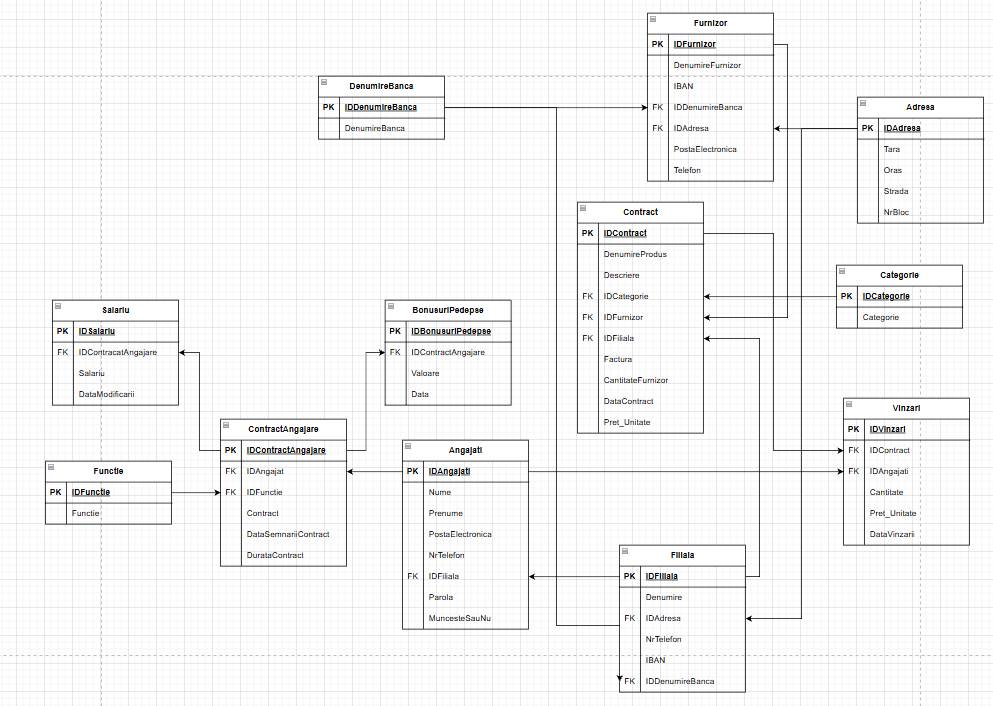

# 🚗 MagazinAuto — Sistem de Management al unui Magazin Auto

> Aplicație Windows Forms desktop dezvoltată în C# (.NET), conectată la o bază de date Microsoft SQL Server LocalDB, pentru gestionarea completă a unui magazin auto: aprovizionare, vânzări, angajați, furnizori și filiale.

---

## 📋 Cuprins

1. [Prezentare generală](#prezentare-generală)
2. [Tehnologii utilizate](#tehnologii-utilizate)
3. [Structura proiectului](#structura-proiectului)
4. [Schema bazei de date](#schema-bazei-de-date)
5. [Descrierea tabelelor](#descrierea-tabelelor)
6. [Relații între tabele](#relații-între-tabele)
7. [Roluri și drepturi de acces](#roluri-și-drepturi-de-acces)
8. [Modulele aplicației](#modulele-aplicației)
9. [Fluxuri principale](#fluxuri-principale)
10. [Validări și reguli de business](#validări-și-reguli-de-business)
11. [Configurare și rulare](#configurare-și-rulare)
12. [Structura fișierelor sursă](#structura-fișierelor-sursă)
13. [Probleme cunoscute și îmbunătățiri sugerate](#probleme-cunoscute-și-îmbunătățiri-sugerate)

---

## Prezentare generală

**MagazinAuto** este o aplicație desktop multi-rol pentru gestionarea operațiunilor unui magazin de piese auto. Sistemul permite:

- Autentificare bazată pe rol (Vânzător, Contabil, Aprovizionator, Administrator)
- Gestionarea stocului de produse prin contracte de aprovizionare
- Înregistrarea și urmărirea vânzărilor
- Managementul angajaților (contracte, salarii, bonusuri/pedepse)
- Gestionarea furnizorilor și filialelor cu date bancare și adrese
- Raportare și filtrare avansată a datelor

---

## Tehnologii utilizate

| Tehnologie | Versiune | Scop |
|---|---|---|
| C# / .NET | 8+ | Limbajul și framework-ul principal |
| Windows Forms (WinForms) | .NET 8 | Interfața grafică desktop |
| Microsoft SQL Server LocalDB | 2019+ | Baza de date relațională |
| ADO.NET (`System.Data.SqlClient`) | Built-in | Accesul la baza de date |
| MSSQL LocalDB `.mdf` | — | Fișier de bază de date portabil |

---

## Structura proiectului

```
Studiu individual/
│
├── Program.cs                  # Punctul de intrare al aplicației
├── Conecsiune.cs               # Clasa singleton pentru conexiunea SQL
├── MagazinAuto.mdf             # Fișierul bazei de date SQL Server LocalDB
│
├── ── FORMULARE DE AUTENTIFICARE ──
├── Form1.cs / .Designer.cs     # Ecranul de login și meniu rapid de test
│
├── ── FORMULARE PRINCIPALE (pe rol) ──
├── Administrator.cs            # Panou complet admin (CRUD pe toate entitățile)
├── Aprovizionator.cs           # Vizualizare și adăugare stoc/marfă
├── Contabil.cs                 # Rapoarte vânzări, angajați, aprovizionare cu filtre
├── Vizator.cs                  # Vizualizare catalog produse cu filtre (vânzător)
│
├── ── FORMULARE DE INSERARE ──
├── AdugareMarfa.cs             # Adăugare produs nou în stoc (contract aprovizionare)
├── Angajati.cs                 # Adăugare angajat nou
├── Vinzare.cs                  # Înregistrare vânzare nouă
├── BonusurPedepse.cs           # Adăugare bonus sau penalizare pentru un angajat
│
├── ── FORMULARE AUXILIARE (lookup/inserare entități secundare) ──
├── Furnizor.cs                 # Adăugare furnizor nou
├── Filiala.cs                  # Adăugare filială nouă
├── Produs.cs                   # Definire produs nou (denumire + categorie + descriere)
├── Categorie.cs                # Adăugare categorie de produs
├── Functie.cs                  # Adăugare funcție/post nou
├── Banca.cs                    # Adăugare denumire bancă nouă
├── Adresa.cs                   # Adăugare adresă nouă
│
├── ── CABINET PERSONAL ──
├── Cabinet Personal.cs         # Profilul angajatului logat (date personale)
├── Parola.cs                   # Modificare telefon / parolă / email
│
└── ── DESIGNER FILES ──
    ├── *.Designer.cs           # Cod generat automat de Visual Studio Designer
    └── *.resx                  # Resurse formular (localizare, imagini)
```

---

## Schema bazei de date



> Diagrama de mai sus ilustrează toate cele **13 tabele** ale bazei de date, cheile primare (PK — portocaliu), cheile externe (FK — albastru) și relațiile dintre entități.

---

## Descrierea tabelelor

### 1. `Angajati`
Stochează datele de identificare și autentificare ale tuturor angajaților.

| Coloană | Tip | Descriere |
|---|---|---|
| `IDAngajati` | INT PK | Identificator unic al angajatului |
| `Nume` | VARCHAR(20) | Numele de familie (max. 20 caractere) |
| `Prenume` | VARCHAR(20) | Prenumele (max. 20 caractere) |
| `PostaElectronica` | VARCHAR(20) | Email — folosit la autentificare (unic) |
| `NrTelefon` | CHAR(9) | Număr de telefon fix de 9 cifre |
| `IDFiliala` | INT FK | Filiala la care este arondat angajatul |
| `Parola` | VARCHAR(15) | Parola de autentificare (min. 8 caract., cel puțin o majusculă, o cifră, un caracter special) |
| `MuncesteSauNu` | BIT/VARCHAR | Starea de activitate a angajatului |

---

### 2. `ContractAngajare`
Leagă un angajat de funcția sa și conține detaliile contractului de muncă.

| Coloană | Tip | Descriere |
|---|---|---|
| `IDContractAngajare` | INT PK | Identificator unic al contractului |
| `IDAngajat` | INT FK → Angajati | Angajatul titular al contractului |
| `IDFunctie` | INT FK → Functie | Funcția/postul angajatului |
| `Contract` | VARCHAR/TEXT | Textul contractului sau referința documentului |
| `DataSemnariiContract` | DATE | Data la care a fost semnat contractul |
| `DurataContract` | INT | Durata contractului (în luni) |

---

### 3. `Salariu`
Istoricul modificărilor salariale ale angajaților.

| Coloană | Tip | Descriere |
|---|---|---|
| `IDSalariu` | INT PK | Identificator unic înregistrare salariu |
| `IDContractAngajare` | INT FK → ContractAngajare | Contractul asociat |
| `Salariu` | DECIMAL | Valoarea salariului curent |
| `DataModificarii` | DATE | Data la care a intrat în vigoare salariul |

---

### 4. `BonusuriPedepse`
Înregistrează bonusurile pozitive și penalizările (valori negative) aplicate angajaților.

| Coloană | Tip | Descriere |
|---|---|---|
| `IDBonusuriPedepse` | INT PK | Identificator unic |
| `IDContractAngajare` | INT FK → ContractAngajare | Contractul angajatului afectat |
| `Valoare` | DECIMAL | Suma (pozitivă = bonus, negativă = penalizare) |
| `Data` | DATE | Data acordării bonusului/penalizării |

> Câmpul `Motiv` apare în codul aplicației (`BonusurPedepse.cs`) ca parametru de inserare, dar nu este vizibil în schema draw.io — probabil este prezent în baza de date fizică.

---

### 5. `Functie`
Tabel de referință pentru funcțiile/posturile disponibile în companie.

| Coloană | Tip | Descriere |
|---|---|---|
| `IDFunctie` | INT PK | Identificator unic |
| `Functie` | VARCHAR(20) | Denumirea funcției (ex: Vânzător, Contabil, Administrator, Aprovizionator) |

> Funcția determină rolul angajatului și ce interfață i se afișează la autentificare.

---

### 6. `Contract`
Reprezintă un lot de produse aprovizionat de la un furnizor pentru o filială. Este entitatea centrală a catalogului de produse.

| Coloană | Tip | Descriere |
|---|---|---|
| `IDContract` | INT PK | Identificator unic al lotului/contractului |
| `DenumireProdus` | VARCHAR(20) | Numele produsului |
| `Descriere` | TEXT | Descrierea detaliată a produsului |
| `IDCategorie` | INT FK → Categorie | Categoria produsului |
| `IDFurnizor` | INT FK → Furnizor | Furnizorul care a livrat produsul |
| `IDFiliala` | INT FK → Filiala | Filiala unde se află stocul |
| `CantitateFurnizor` | INT | Cantitatea inițial livrată de furnizor |
| `Pret_Unitate` | DECIMAL | Prețul de achiziție per unitate |
| `DataContract` | DATE | Data aprovizionării |

> **Stocul disponibil** se calculează dinamic: `CantitateFurnizor - SUM(Vinzari.Cantitate WHERE IDContract = X)`

---

### 7. `Vinzari`
Înregistrările de vânzare efectuate de angajați.

| Coloană | Tip | Descriere |
|---|---|---|
| `IDVinzari` | INT PK | Identificator unic al vânzării |
| `IDContract` | INT FK → Contract | Produsul vândut (lotul din care s-a scăzut) |
| `IDAngajat` | INT FK → Angajati | Angajatul care a efectuat vânzarea |
| `Cantitate` | INT | Numărul de unități vândute |
| `Pret_Unitate` | DECIMAL | Prețul de vânzare per unitate |
| `DataVinzarii` | DATE | Data vânzării |

---

### 8. `Furnizor`
Date complete despre furnizorii companiei.

| Coloană | Tip | Descriere |
|---|---|---|
| `IDFurnizor` | INT PK | Identificator unic |
| `DenumireFurnizor` | VARCHAR(30) | Numele companiei furnizoare |
| `IBAN` | CHAR(24) | Contul bancar IBAN (format: 2 litere majuscule + 22 cifre) |
| `IDDenumireBanca` | INT FK → DenumireBanca | Banca la care are contul |
| `IDAdresa` | INT FK → Adresa | Adresa sediului furnizorului |
| `PostaElectronica` | VARCHAR(20) | Email de contact |
| `Telefon` | CHAR(9) | Număr de telefon (9 cifre) |

---

### 9. `Filiala`
Filialele (punctele de lucru) ale companiei.

| Coloană | Tip | Descriere |
|---|---|---|
| `IDFiliala` | INT PK | Identificator unic |
| `Denumire` | VARCHAR(30) | Numele filialei |
| `IDAdresa` | INT FK → Adresa | Adresa fizică a filialei |
| `NrTelefon` | CHAR(9) | Numărul de telefon al filialei |
| `IBAN` | CHAR(24) | Contul bancar al filialei |
| `IDDenumireBanca` | INT FK → DenumireBanca | Banca asociată |

---

### 10. `Adresa`
Tabel de referință normalizat pentru adrese (utilizat de Furnizor și Filiala).

| Coloană | Tip | Descriere |
|---|---|---|
| `IDAdresa` | INT PK | Identificator unic |
| `Tara` | VARCHAR(30) | Țara (numai litere) |
| `Oras` | VARCHAR(30) | Orașul (numai litere) |
| `Strada` | VARCHAR(30) | Strada (numai litere) |
| `NrBloc` | VARCHAR(30) | Numărul blocului/casei (cifre și `/`) |

---

### 11. `DenumireBanca`
Tabel de referință pentru băncile disponibile în sistem.

| Coloană | Tip | Descriere |
|---|---|---|
| `IDDenumireBanca` | INT PK | Identificator unic |
| `DenumireBanca` | VARCHAR(30) | Denumirea băncii (numai litere) |

---

### 12. `Categorie`
Categorii de produse pentru clasificarea catalogului.

| Coloană | Tip | Descriere |
|---|---|---|
| `IDCategorie` | INT PK | Identificator unic |
| `Categorie` | VARCHAR(30) | Denumirea categoriei (ex: Filtre, Ulei motor, Anvelope) |

---

### 13. `ContractAngajare` (și tabelele HR)
> Vezi tabelele 2, 3 și 4 de mai sus pentru detalii complete despre modulul de resurse umane.

---

## Relații între tabele

```
Angajati ──────────────────────────┐
    │ 1:N                          │ N:1
    ▼                              ▼
ContractAngajare ◄──── Functie   Filiala ◄──── Adresa
    │ 1:N      1:1                   │ 1:N      │ 1:N
    ├─────► Salariu                  │          ▼
    └─────► BonusuriPedepse          │      DenumireBanca
                                     │
Contract ◄─────────────────────────┘ (IDFiliala)
    │ N:1 ◄──── Furnizor ◄──── Adresa / DenumireBanca
    │ N:1 ◄──── Categorie
    │ 1:N
    ▼
Vinzari ◄──── Angajati
```

**Tipuri de relații:**

| Relație | Cardinalitate | Descriere |
|---|---|---|
| Angajati → ContractAngajare | 1:N | Un angajat poate avea mai multe contracte (istoric) |
| Angajati → Vinzari | 1:N | Un angajat poate efectua mai multe vânzări |
| ContractAngajare → Salariu | 1:N | Un contract poate avea mai multe modificări salariale |
| ContractAngajare → BonusuriPedepse | 1:N | Un contract poate acumula mai multe bonusuri/penalizări |
| Contract → Vinzari | 1:N | Un lot de produse poate fi vândut în mai multe tranzacții |
| Furnizor → Contract | 1:N | Un furnizor poate livra mai multe loturi |
| Filiala → Contract | 1:N | O filială poate gestiona mai multe loturi de produse |
| Filiala → Angajati | 1:N | La o filială lucrează mai mulți angajați |
| Categorie → Contract | 1:N | O categorie poate include mai multe produse |
| DenumireBanca → Furnizor | 1:N | O bancă poate fi folosită de mai mulți furnizori |
| DenumireBanca → Filiala | 1:N | O bancă poate fi folosită de mai multe filiale |
| Adresa → Furnizor | 1:N | O adresă poate fi asociată mai multor entități |
| Adresa → Filiala | 1:N | O adresă poate fi asociată mai multor filiale |

---

## Roluri și drepturi de acces

Aplicația implementează un sistem RBAC (Role-Based Access Control) bazat pe câmpul `Functie` al angajatului.

### 🔴 Administrator
**Formular:** `Administrator.cs`

Accesează toate funcționalitățile sistemului:
- ✅ Vizualizare: Produse, Vânzări, Angajați, Filiale, Furnizori
- ✅ Inserare: Angajat nou, Produs nou, Vânzare nouă, Bonus/Penalizare
- ✅ Ștergere: Orice înregistrare prin click-dreapta → "Stergere interogare"
- ✅ Cabinet Personal (modificare date proprii)

### 🟡 Aprovizionator
**Formular:** `Aprovizionator.cs`

Se ocupă exclusiv de gestionarea stocului:
- ✅ Vizualizare catalog produse cu cantitate disponibilă calculată
- ✅ Adăugare marfă nouă (contract de aprovizionare)
- ✅ Sortare după: denumire A-Z, Z-A, cantitate crescător/descrescător, preț
- ✅ Cabinet Personal
- ❌ Nu poate accesa date angajați sau vânzări detaliate

### 🟢 Contabil
**Formular:** `Contabil.cs`

Accesează rapoarte financiare și HR cu filtrare avansată:
- ✅ Raport Vânzări cu filtrare după: Angajat, Filială, Furnizor, căutare după denumire produs
- ✅ Raport Angajați cu: Salariu, Total Bonusuri/Pedepse, funcție, filtrare după filială/funcție
- ✅ Raport Aprovizionare cu filtrare după: Categorie, Filială, Furnizor
- ✅ Cabinet Personal
- ❌ Nu poate efectua inserări sau ștergeri

### 🔵 Vânzător (Vizator)
**Formular:** `Vizator.cs`

Interfață simplificată pentru angajații din vânzări:
- ✅ Vizualizare catalog produse disponibile cu stoc actualizat
- ✅ Filtrare după: Categorie, Filială, Furnizor
- ✅ Căutare după denumire produs
- ✅ Cabinet Personal
- ❌ Nu poate înregistra vânzări direct din această interfață

> **Notă:** Vânzările sunt înregistrate de Administrator prin formularul `Vinzare.cs`.

---

## Modulele aplicației

### Modulul de Autentificare (`Form1.cs`)

Ecranul de start al aplicației îndeplinește două funcții:
1. **Login real** — câmpurile `textBox1` (email) și `textBox2` (parolă) sunt verificate prin query SQL față de tabela `Angajati` JOIN `ContractAngajare` JOIN `Functie`. În funcție de valoarea câmpului `Functie`, se deschide formularul corespunzător rolului.
2. **Butoane de test rapid** — butoanele 1-4 deschid direct formularele celor 4 roluri cu ID-uri hardcodate (1002, 1003, 1004, 1013), utile în development.

**Query de autentificare:**
```sql
SELECT Angajati.IDAngajati, Functie.Functie
FROM Angajati
JOIN ContractAngajare ON ContractAngajare.IDAngajat = Angajati.IDAngajati
JOIN Functie ON ContractAngajare.IDFunctie = Functie.IDFunctie
WHERE Angajati.PostaElectronica = '...' AND Angajati.Parola = '...'
```

---

### Modulul de Stoc și Aprovizionare (`AdugareMarfa.cs`, `Contract`)

Stocul disponibil **nu este o coloană separată** în baza de date. El se calculează la fiecare afișare astfel:
1. Se preia `CantitateFurnizor` din `Contract`
2. Se scade `SUM(Cantitate)` din `Vinzari` pentru același `IDContract`

```csharp
foreach (DataGridViewRow rindProdus in dataGridView1.Rows)
    foreach (DataRow rindVind in setSC.Tables[0].Rows)
        if (IDContract(rindProdus) == IDContract(rindVind))
            rindProdus.Cells[6].Value -= Convert.ToInt32(rindVind["Cantitate"]);
```

**Adăugarea unui produs nou** presupune:
1. Selectarea sau crearea unui **Produs** (cu denumire, descriere, categorie)
2. Selectarea unui **Furnizor** existent sau crearea unuia nou
3. Selectarea unei **Filiale** existente sau crearea uneia noi
4. Completarea cantității livrate, prețului de achiziție și datei
5. Inserarea unui rând în tabela `Contract`

---

### Modulul de Vânzări (`Vinzare.cs`)

La înregistrarea unei vânzări, aplicația efectuează **3 validări de business** înainte de inserare:

1. **Validare stoc:** Cantitatea vândută ≤ stocul disponibil calculat dinamic
2. **Validare preț minim:** `Pret_Unitate_Vanzare >= Pret_Unitate_Achizitie` (nu se poate vinde sub preț de cost)
3. **Validare preț maxim:** `Pret_Unitate_Vanzare <= Pret_Unitate_Achizitie * 3.0` (marja maximă de 200%)

```csharp
// Verificare stoc
if (Convert.ToInt32(textBox1.Text) > stocDisponibil)
    MessageBox.Show("Cantitatea depaseste stocul disponibil!");

// Verificare pret
if (pretVanzare < pretAchizitie || pretVanzare > pretAchizitie + pretAchizitie * 2.0)
    MessageBox.Show("Pretul nu este in limitele permise!");
```

---

### Modulul HR (`Angajati.cs`, `ContractAngajare`, `Salariu`)

Adăugarea unui angajat nou se realizează prin **3 inserări consecutive**:

1. **INSERT** în `Angajati` — cu parola implicită `12345aA_`
2. **INSERT** în `ContractAngajare` — cu data semnării = ziua curentă
3. **INSERT** în `Salariu` — salariul inițial specificat în formular

```csharp
// 1. Inserare angajat
INSERT INTO Angajati (Nume, Prenume, PostaElectronica, NrTelefon, IDFiliala, Parola, MuncesteSauNu)
VALUES (@Nume, @Prenume, @PostaElectronica, @NrTelefon, @IDFiliala, '12345aA_', 'True')

// 2. Inserare contract (IDAngajat obținut prin SELECT după email)
INSERT INTO ContractAngajare (IDAngajat, IDFunctie, DataSemnariiContract, DurataContract)
VALUES (@IDAngajat, @IDFunctie, GETDATE(), @DurataContract)

// 3. Inserare salariu
INSERT INTO Salariu (IDContractAngajare, Salariu, DataModificarii)
VALUES (@IDContractAngajare, @Salariu, GETDATE())
```

---

### Modulul Cabinet Personal (`Cabinet Personal.cs`, `Parola.cs`)

Fiecare angajat autentificat poate să-și vizualizeze datele proprii și să modifice:
- **Numărul de telefon** (validare: exact 9 cifre)
- **Parola** (validare complexitate: min. 8, max. 15 caract., cel puțin o majusculă, o minusculă, o cifră, un caracter special)
- **Adresa de email**

> **Bug cunoscut:** În metodele `modificaParolaToolStripMenuItem_Click` și `modificaPostaElectronicaToolStripMenuItem_Click`, comanda SQL de UPDATE modifică `NrTelefon` în loc de `Parola`/`PostaElectronica`. Aceasta este o eroare de copy-paste care trebuie corectată.

---

### Modulul Raportare Contabil (`Contabil.cs`)

Contabilul beneficiază de **3 rapoarte distincte** cu filtrare multi-criteriu:

**Raport Vânzări** — filtrare după:
- Angajat (comboBox1)
- Filială (comboBox2)
- Furnizor (comboBox3)
- Căutare text după denumire produs

**Raport Angajați** — filtrare după:
- Funcție (comboBox1)
- Filială (comboBox2)
- Câmpuri afișate: Salariu, Total Bonusuri/Pedepse (SUM agregat)

**Raport Aprovizionare** — filtrare după:
- Furnizor (comboBox1)
- Filială (comboBox2)
- Categorie (comboBox3)
- Căutare text după denumire produs
- Stoc calculat dinamic

---

### Modulul Ștergere (`stergereInterogareToolStripMenuItem_Click` în `Administrator.cs`)

Administratorul poate șterge înregistrări din interfața principală prin click-dreapta pe un rând → "Stergere interogare". Operația de ștergere depinde de tabela afișată curent (`afisare`):

| Valoare `afisare` | Tabela afișată | Coloana ID |
|---|---|---|
| 1 | Contract (Produse) | IDContract |
| 2 | Vinzari | IDVinzari |
| 3 | Angajati | IDAngajati |
| 4 | Filiala | IDFiliala |
| 5 | Furnizor | IDFurnizor |

> **Atenție:** Ștergerea nu verifică existența cheilor externe în alte tabele — poate apărea eroare SQL dacă există dependențe.

---

## Fluxuri principale

### Flux: Autentificare și navigare

```
[Form1 - Login]
      │
      ▼ (verificare email + parolă în BD)
 ┌────┴─────────────────────────────────────┐
 │                                          │
 ▼                                          ▼
[Functie = "Vinzator"]             [Functie = "Administrator"]
      │                                     │
      ▼                                     ▼
[Vizator.cs]                        [Administrator.cs]
      │                                     │
      └─────► [Cabinet_Personal.cs] ◄───────┘
```

### Flux: Adăugare produs în stoc

```
[AdugareMarfa - buton Produs nou]
        │
        ▼
[Produs.cs] → (opțional) [Categorie.cs] → INSERT Categorie
        │
        ▼ (setează denumireNew, categorieNew, descriereNew)
[AdugareMarfa - buton Furnizor nou]
        │
        ▼
[Furnizor.cs] → (opțional) [Banca.cs] → INSERT DenumireBanca
             → (opțional) [Adresa.cs] → INSERT Adresa
        │
        ▼ INSERT Furnizor
[AdugareMarfa - buton Filiala noua]
        │
        ▼
[Filiala.cs] → (opțional) [Banca.cs], [Adresa.cs]
        │
        ▼ INSERT Filiala
[AdugareMarfa - buton Adauga]
        │
        ▼ INSERT Contract (cantitate, pret, data, IDFurnizor, IDFiliala, IDCategorie)
```

### Flux: Înregistrare vânzare

```
[Vinzare.cs - deschis de Administrator]
      │
      ├── Selectare Produs (IDContract) din comboBox1
      ├── Selectare Angajat din comboBox2
      ├── Introducere Cantitate și Preț Unitate
      │
      ▼ (click Adaugă)
 ┌────┴──────────────────────────────────┐
 │ Validare 1: Cantitate ≤ Stoc disponibil │
 │ Validare 2: Pret ≥ PretAchizitie       │
 │ Validare 3: Pret ≤ PretAchizitie * 3   │
 └────┬──────────────────────────────────┘
      │ (toate valide)
      ▼
 INSERT INTO Vinzari (IDContract, IDAngajat, Cantitate, Pret_Unitate, DataVinzarii)
```

---

## Validări și reguli de business

### Validări de format (implementate cu `Regex` în `KeyPress`)

| Câmp | Regex | Regulă |
|---|---|---|
| Nume, Prenume | `^[a-zA-Z\s\b]$` | Doar litere și spații |
| Email | `^[^@\s]+@[^@\s]+\.[^@\s]+$` | Format email valid |
| Telefon | `^[0-9\b]$` + lungime 9 | Exact 9 cifre |
| IBAN | `^[A-Z0-9\b]$` + lungime 24 + 2 litere majuscule la început | Format IBAN |
| Cantitate | `^[0-9\b]$` | Numai cifre întregi |
| Preț | `^[0-9.\b]$` | Număr zecimal pozitiv |
| Adresă (Tara, Oras, Strada) | `^[a-zA-Z\s\b]$` | Numai litere |
| NrBloc | `^[0-9/\s\b]$` | Cifre și slash |
| Categorie, Funcție, Bancă | `^[a-zA-Z\s\b]$` | Numai litere |

### Validări de unicitate

- La adăugarea unui nou furnizor/filială/categorie/funcție/bancă/adresă, aplicația verifică dacă elementul există deja în lista combo box aferentă, prevenind duplicatele vizibile.

### Restricții lungime

| Câmp | Lungime maximă |
|---|---|
| Tara, Oras, Strada, NrBloc | 30 caractere |
| Denumire Filiala, Furnizor, Categorie, Bancă | 30 caractere |
| Functie | 20 caractere |
| Denumire Produs | 20 caractere |
| Parola | 8 – 15 caractere |
| Email | 20 caractere |

### Reguli business pentru vânzări

- **Stoc:** Nu se poate vinde mai mult decât există în depozit
- **Preț minim:** Prețul de vânzare ≥ Prețul de achiziție
- **Preț maxim:** Prețul de vânzare ≤ Prețul de achiziție × 3 (marjă max. 200%)
- **Parola implicită** la crearea unui angajat: `12345aA_`

---

## Configurare și rulare

### Cerințe de sistem

- **OS:** Windows 10 / 11
- **.NET SDK:** 8.0 sau mai recent
- **Visual Studio:** 2022 (recomandat) sau VS Code cu extensia C#
- **SQL Server LocalDB:** Inclusă cu Visual Studio (componenta `SQL Server Express LocalDB`)

### Pași de instalare

1. **Clonați sau descărcați proiectul:**
   ```bash
   git clone <repository-url>
   cd "Studiu individual"
   ```

2. **Actualizați calea bazei de date în `Conecsiune.cs`:**
   ```csharp
   // Modificați calea către fișierul .mdf pe calculatorul dumneavoastră:
   public SqlConnection c = new SqlConnection(
       @"Data Source=(LocalDB)\MSSQLLocalDB;" +
       @"AttachDbFilename=""C:\Calea\Voastra\MagazinAuto.mdf"";" +
       @"Integrated Security=True;Connect Timeout=30"
   );
   ```

3. **Deschideți soluția în Visual Studio:**
   - `Studiu_individual.sln`

4. **Build și Run:**
   - `Ctrl+Shift+B` pentru build
   - `F5` pentru rulare în mod debug

### Configurare baza de date

Fișierul `MagazinAuto.mdf` trebuie să existe la calea specificată în `Conecsiune.cs`. La prima rulare, asigurați-vă că:
- SQL Server LocalDB este instalat (`sqllocaldb info` în Command Prompt)
- Instanța `MSSQLLocalDB` este pornită (`sqllocaldb start MSSQLLocalDB`)
- Fișierul `.mdf` nu este deschis de altă instanță

---

## Structura fișierelor sursă

### Ierarhia logică a formularelor

```
Form1 (Login)
├── Administrator
│   ├── AdugareMarfa
│   │   ├── Produs
│   │   │   └── Categorie
│   │   ├── Furnizor
│   │   │   ├── Banca
│   │   │   └── Adresa
│   │   └── Filiala
│   │       ├── Banca
│   │       └── Adresa
│   ├── Angajati
│   │   ├── Functie
│   │   └── Filiala (refolosit)
│   ├── Vinzare
│   ├── BonusurPedepse
│   └── Cabinet_Personal
│       └── Parola
├── Aprovizionator
│   ├── AdugareMarfa (refolosit)
│   └── Cabinet_Personal (refolosit)
├── Contabil
│   └── Cabinet_Personal (refolosit)
└── Vizator
    └── Cabinet_Personal (refolosit)
```

### Clasa `Conecsiune`

Clasă simplă care expune o singură instanță `SqlConnection`. **Nu implementează pooling sau Singleton adevărat** — fiecare formular instanțiază propria clasă `Conecsiune`, dar partajează aceeași connection string.

```csharp
internal class Conecsiune
{
    public SqlConnection c = new SqlConnection(@"Data Source=(LocalDB)\MSSQLLocalDB;
        AttachDbFilename=""C:\...\MagazinAuto.mdf"";
        Integrated Security=True;Connect Timeout=30");
}
```

> **Recomandare:** Trece la `using` blocks sau `connection pooling` pentru gestionarea mai robustă a conexiunilor.

---

## Probleme cunoscute și îmbunătățiri sugerate

### 🐛 Bug-uri identificate în cod

| Locație | Descriere | Impact |
|---|---|---|
| `Cabinet Personal.cs` → `modificaParolaToolStripMenuItem_Click` | UPDATE modifică `NrTelefon` în loc de `Parola` | Critica — parola nu se schimbă efectiv |
| `Cabinet Personal.cs` → `modificaPostaElectronicaToolStripMenuItem_Click` | UPDATE modifică `NrTelefon` în loc de `PostaElectronica` | Critic — emailul nu se schimbă |
| `Angajati.cs` → `button3_Click` | La inserarea contractului se folosește `comboBox1.SelectedValue` (IDFiliala) în loc de `comboBox2.SelectedValue` (IDFunctie) | Critic — funcția angajatului nu se salvează corect |
| `Categorie.cs` → `button1_Click` | `insert.ExecuteNonQuery()` este apelat de **două ori** | Minor — se inserează categorii duplicate |
| `Form1.cs` → `button5_Click` | Condiția `if (a.Rows.Count > 1)` ar trebui `> 0` | Major — autentificarea eșuează pentru utilizatori valizi |
| `Vinzare.cs` | Mesajul de eroare pentru preț menționează „20 de procent" dar codul permite 200% | Minor — inconsistență UX |
| SQL Queries | Construirea query-urilor prin concatenare string (risc SQL Injection) | Securitate — trebuie folosiți parametri SQL pentru toate query-urile dinamice |

### 🔧 Îmbunătățiri recomandate

1. **Securitate:** Parola ar trebui stocată hash-uită (bcrypt/SHA256), nu în text plain
2. **Arhitectură:** Separarea logicii de business de UI (pattern Repository sau DAL)
3. **Connection management:** Folosirea pattern-ului `using` pentru SqlConnection/SqlCommand
4. **SQL Injection:** Înlocuirea tuturor concatenărilor de string în query-uri cu parametri `@param`
5. **Tranzacții:** Inserările multiple (ex: angajat + contract + salariu) ar trebui executate într-o tranzacție SQL
6. **Stoc:** Calcularea stocului la nivel de query SQL (subquery sau view) în loc de buclă C# pe DataGridView
7. **Audit trail:** Adăugarea câmpurilor `CreatedAt`, `UpdatedAt`, `CreatedBy` pentru urmărirea modificărilor
8. **Responsive UI:** Adăugarea de loading indicators pentru operații lungi pe BD
9. **Backup:** Implementarea unui mecanism de backup automat al fișierului `.mdf`
10. **Logging:** Implementarea unui sistem de logare a erorilor SQL

---

## Interogări SQL cheie utilizate în aplicație

### Afișare produse cu stoc calculat
```sql
SELECT Contract.IDContract,
       Contract.DenumireProdus as 'Denumire Produs',
       Contract.Descriere,
       Categorie.Categorie,
       Furnizor.DenumireFurnizor as 'Denumire Furnizor',
       Filiala.Denumire as 'Denumire Filiala',
       Contract.CantitateFurnizor as 'Cantitate',
       Contract.Pret_Unitate as 'Pret Unitate',
       Contract.DataContract as 'Data Aprovizionarii'
FROM Contract
JOIN Categorie ON Contract.IDCategorie = Categorie.IDCategorie
JOIN Furnizor ON Contract.IDFurnizor = Furnizor.IDFurnizor
JOIN Filiala ON Contract.IDFiliala = Filiala.IDFiliala
ORDER BY DenumireProdus;
-- Nota: Stocul disponibil se calculeaza post-query in C#
```

### Afișare angajați cu agregare salariu + bonusuri
```sql
SELECT Angajati.IDAngajati,
       (Angajati.Nume + ' ' + Angajati.Prenume) as 'Nume Prenume',
       Angajati.PostaElectronica,
       Angajati.NrTelefon,
       Filiala.Denumire as 'Denumire Filiala',
       Functie.Functie,
       Salariu.Salariu,
       SUM(BonusuriPedepse.Valoare) as 'Total Bonusuri si Pedepse',
       ContractAngajare.DataSemnariiContract,
       ContractAngajare.DurataContract
FROM Angajati
JOIN ContractAngajare ON Angajati.IDAngajati = ContractAngajare.IDAngajat
JOIN Functie ON Functie.IDFunctie = ContractAngajare.IDFunctie
JOIN Salariu ON Salariu.IDContractAngajare = ContractAngajare.IDContractAngajare
LEFT JOIN BonusuriPedepse ON BonusuriPedepse.IDContractAngajare = ContractAngajare.IDContractAngajare
JOIN Filiala ON Filiala.IDFiliala = Angajati.IDFiliala
GROUP BY Angajati.IDAngajati, Angajati.Nume, Angajati.Prenume,
         Filiala.Denumire, Functie.Functie, Salariu.Salariu,
         Angajati.PostaElectronica, Angajati.NrTelefon,
         ContractAngajare.DurataContract, ContractAngajare.DataSemnariiContract
ORDER BY 'Nume Prenume';
```

### Afișare vânzări complete
```sql
SELECT Vinzari.IDVinzari,
       Contract.DenumireProdus,
       Furnizor.DenumireFurnizor,
       Filiala.Denumire,
       Angajati.Nume, Angajati.Prenume,
       Vinzari.Cantitate,
       Vinzari.Pret_Unitate + Vinzari.Cantitate as 'Pret',
       Vinzari.DataVinzarii
FROM Contract
JOIN Furnizor ON Contract.IDFurnizor = Furnizor.IDFurnizor
JOIN Filiala ON Contract.IDFiliala = Filiala.IDFiliala
JOIN Vinzari ON Vinzari.IDContract = Contract.IDContract
JOIN Angajati ON Vinzari.IDAngajat = Angajati.IDAngajati;
```

---

*Documentație generată pentru proiectul **Studiu Individual — MagazinAuto**, realizat ca aplicație desktop Windows Forms în C# cu SQL Server LocalDB.*
